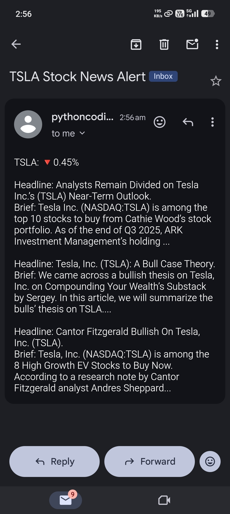
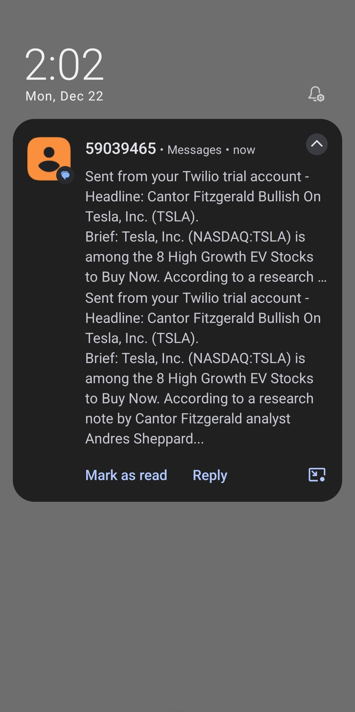

# 📈 Stock News Alert

A Python-based automation project that monitors stock price movements and sends relevant news updates via **email alerts**.

Built as part of **Day 36 of the #100DaysOfCode (Python)** challenge, this project focuses on learning how real-world systems combine **APIs, data processing, and notifications**.

---

## 📌 Project Overview

Stock prices move every day — but understanding *why* they move often requires checking multiple sources.

This project automates that process by:
- Tracking daily stock price changes
- Detecting significant movement
- Fetching related news automatically
- Sending everything in a clean, readable email

The goal is not prediction, but **information awareness through automation**.

---

## ✨ Features

- 📊 **Daily Stock Tracking**  
  Fetches daily closing prices for a given stock symbol

- 📈 **Percentage Change Calculation**  
  Compares yesterday’s closing price with the previous day

- 📰 **Automatic News Fetching**  
  Retrieves top related news articles when a threshold is crossed

- 📬 **Email Alerts**  
  Sends a single, well-formatted email with stock movement and news

- 🔐 **Secure Configuration**  
  Uses environment variables (`.env`) to protect credentials

- 🐧 **Linux-Friendly Workflow**  
  Built and tested in a Linux (Ubuntu) environment

---

## 🧠 How It Works

1. Fetch daily stock price data using a stock market API  
2. Calculate percentage change between the last two trading days  
3. Check if the change exceeds a defined threshold  
4. Fetch the top related news articles using a news API  
5. Format everything into a readable message  
6. Send the alert via email automatically  

---

## 📸 Output Preview

  
  

The email alert includes:
- Stock movement direction
- Percentage change
- Related news headlines and summaries

## ⚙️ Configuration

You can customize the following values in the code:

- `STOCK_NAME` – Stock symbol to track (e.g., TSLA, AAPL)
- `COMPANY_NAME` – Company name for news search
- `THRESHOLD_PERCENT` – Percentage change required to trigger an alert

## ⚠️ Known Limitations

- Depends on free-tier API limits (rate limiting may apply)
- Market data is based on daily closing prices, not real-time
- News relevance depends on API search accuracy

## 🔒 Security

- API keys and email credentials are stored in environment variables
- Sensitive files are excluded using `.gitignore`
- No credentials are hardcoded in the source code

## 🙌 Acknowledgement

This project was built as part of Day 36 of the *100 Days of Python* course,
with additional modifications and improvements made during implementation.

